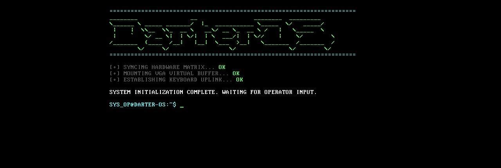

# Darter OS

A 32-bit x86 kernel written from scratch in C and NASM assembly, with a custom VGA text driver, keyboard input, and an interactive shell.


*Boot screen and interactive shell running in QEMU.*

## Features

- Assembly bootstrap that hands control to the C kernel
- Custom linker script defining the kernel's memory layout
- VGA text-mode driver with a sci-fi retro terminal theme
- Keyboard input handling
- Interactive shell with command recognition
- `sysinfo` command that reports kernel diagnostics

## Build and run

Requirements: `nasm`, an i686 cross-compiler (`i686-linux-gnu-gcc`), GNU `ld`, and `qemu-system-i386`.

```
nasm -f elf32 boot.asm -o boot.o
i686-linux-gnu-gcc -m32 -c kernel.c -o kernel.o -std=gnu99 -ffreestanding -O2 -Wall -Wextra
ld -m elf_i386 -T linker.ld -o darter.bin boot.o kernel.o
qemu-system-i386 -kernel darter.bin
```

## Project structure

| File | Purpose |
| --- | --- |
| `boot.asm` | Entry point and bootstrap code |
| `kernel.c` | Kernel main, VGA driver, keyboard input, shell |
| `linker.ld` | Linker script and memory layout |

## How it works

QEMU loads `darter.bin` directly and jumps to the entry point in `boot.asm`. The bootstrap prepares the environment the needed C code, then calls the kernel. The kernel prints the boot screen to VGA text memory, then enters a loop that reads keystrokes and matches the input against known commands.

## Author

Advaith Joseph, B.Sc. Computer Science Engineering, Vistula University, Warsaw.
[LinkedIn](https://linkedin.com/in/advaith-joseph)
